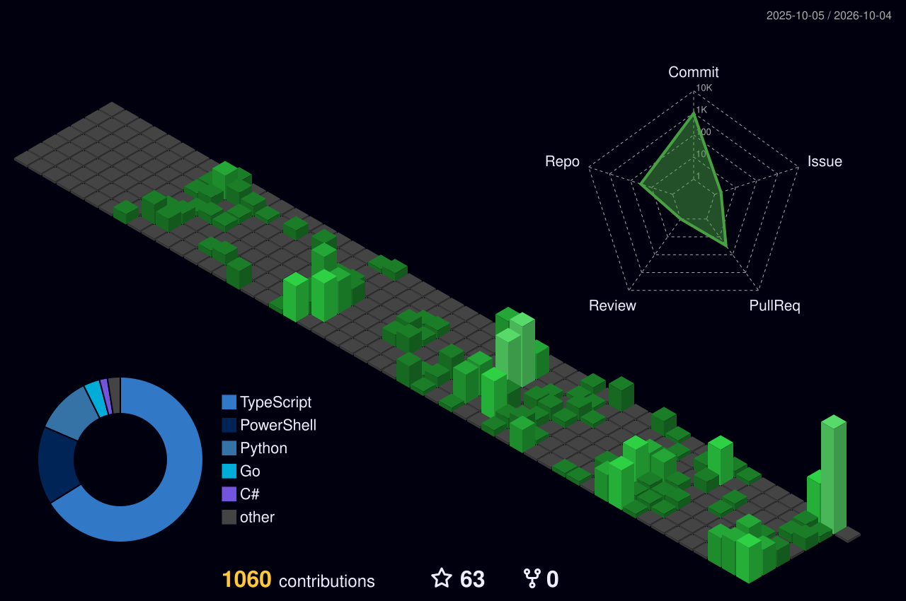

<div align="center">

<!-- ═══════════════════ ANIMATED WAVE HEADER ═══════════════════ -->


<!-- ═══════════════════ SOCIAL BADGE STRIP ═══════════════════ -->

[](https://jyotirmoyb.com/)
[](https://linkedin.com/in/jyotirmoybhowmik)
[](https://www.credly.com/users/jyotirmoy-bhowmik/badges)
[](https://x.com/jyotu_b)
[](https://github.com/JyotirmoyBhowmik)

<!-- ═══════════════════ TERMINAL TYPING SVG ═══════════════════ -->
<br/>
<a href="https://git.io/typing-svg"></a>

</div>

<!-- ═══════════════════ DIVIDER ═══════════════════ -->


<!-- ═══════════════════ ABOUT: CONFIG FILE ═══════════════════ -->
##  `root@jyotirmoy:~# cat /etc/profile.d/executive.yaml`

```yaml
# ──────────────────────────────────────────────────────────
# Executive Technology Profile — Jyotirmoy Bhowmik
# ──────────────────────────────────────────────────────────
Name:         Jyotirmoy Bhowmik
Title:        Manager — IT Infrastructure & Networks (Grade IS4)
Organization: Surya Nepal Pvt. Ltd. (ITC Group)
Experience:   15+ Years | India & South Asia
Locations:    🇮🇳 India  •  🇳🇵 Nepal  •  🇸🇬 Singapore  •  🇲🇾 Malaysia  •  🇧🇩 Bangladesh  •  🇦🇺 Australia

Mission: >
  Architecting secure, resilient, mission-critical enterprise technology
  platforms — from data center racks to cloud-native applications.

Competencies:
  Cloud & DR:      [ Azure, AWS, Multi-Region Disaster Recovery, SAP ERP Cloud DR ]
  OT Security:     [ ISA/IEC 62443, Claroty CTD, SCADA Hardening, Zero Trust ]
  Engineering:     [ Next.js 15, React 19, Go, Python, TypeScript, Supabase, PostgreSQL ]
  Automation:      [ PowerShell IaC, Ansible, Docker, CI/CD Pipelines ]
  Governance:      [ IT Policy 2.0, CapEx/OpEx Financial Management, Vendor Strategy ]

Current_Focus:
  - 🔭 Building production-grade enterprise management platforms
  - 🛡️ Advancing OT/IT convergence security architectures
  - 🌱 Contributing to open-source infrastructure tooling
  - ⚡ Fun: Bridging CxO strategy decks with hands-on terminal hacking
```


<!-- ═══════════════════ TECH STACK: SKILL ICONS ═══════════════════ -->
## 🧬 `sudo lshw -short` — Technology Arsenal

<div align="center">

<table>
<tr><td colspan="7" align="center"><b>☁️ Cloud, Infrastructure & Platform Engineering</b></td></tr>
<tr>
<td align="center" width="96"><br><sub><b>Azure</b></sub></td>
<td align="center" width="96"><br><sub><b>AWS</b></sub></td>
<td align="center" width="96"><br><sub><b>GCP</b></sub></td>
<td align="center" width="96"><br><sub><b>Docker</b></sub></td>
<td align="center" width="96"><br><sub><b>Kubernetes</b></sub></td>
<td align="center" width="96"><br><sub><b>Ansible</b></sub></td>
<td align="center" width="96"><br><sub><b>Terraform</b></sub></td>
</tr>
</table>

<table>
<tr><td colspan="8" align="center"><b>🚀 Full-Stack Software Engineering</b></td></tr>
<tr>
<td align="center" width="96"><br><sub><b>Next.js 15</b></sub></td>
<td align="center" width="96"><br><sub><b>React 19</b></sub></td>
<td align="center" width="96"><br><sub><b>TypeScript</b></sub></td>
<td align="center" width="96"><br><sub><b>Go</b></sub></td>
<td align="center" width="96"><br><sub><b>Python</b></sub></td>
<td align="center" width="96"><br><sub><b>Supabase</b></sub></td>
<td align="center" width="96"><br><sub><b>PostgreSQL</b></sub></td>
<td align="center" width="96"><br><sub><b>Tailwind</b></sub></td>
</tr>
</table>

<table>
<tr><td colspan="7" align="center"><b>🛡️ Security, DevOps & Tools</b></td></tr>
<tr>
<td align="center" width="96"><br><sub><b>Linux</b></sub></td>
<td align="center" width="96"><br><sub><b>PowerShell</b></sub></td>
<td align="center" width="96"><br><sub><b>Cloudflare</b></sub></td>
<td align="center" width="96"><br><sub><b>GH Actions</b></sub></td>
<td align="center" width="96"><br><sub><b>Vercel</b></sub></td>
<td align="center" width="96"><br><sub><b>C# / .NET</b></sub></td>
<td align="center" width="96"><br><sub><b>Kotlin</b></sub></td>
</tr>
</table>

<!-- OT/Enterprise Security Badges -->
<br/>


</div>


<!-- ═══════════════════ INFRASTRUCTURE ARCHITECTURE DIAGRAM ═══════════════════ -->
## 🏗️ `terraform plan` — Enterprise Architecture Overview

```mermaid
%%{init: {'theme':'dark','themeVariables':{'primaryColor':'#00ff41','primaryTextColor':'#c9d1d9','primaryBorderColor':'#00ff41','lineColor':'#58a6ff','secondaryColor':'#161b22','tertiaryColor':'#0d1117','fontFamily':'JetBrains Mono'}}}%%
graph TB
    subgraph CLOUD["☁️ Multi-Cloud (Azure + AWS)"]
        AZ[Azure AD / Entra ID]
        M365[Microsoft 365]
        SAP[SAP ERP Cloud DR]
        DR[Multi-Region DR/BCP]
    end

    subgraph EDGE["🌐 Edge & CDN"]
        CF[Cloudflare WAF/CDN]
        VRL[Vercel Edge Network]
    end

    subgraph APPS["🚀 Application Layer"]
        NXT["Next.js 15 / React 19"]
        SB[Supabase + PostgreSQL]
        API["Go / Python APIs"]
    end

    subgraph INFRA["🔧 On-Prem Infrastructure"]
        DC[Data Center Ops]
        NET[Enterprise Network]
        ANS[Ansible IaC]
        PS[PowerShell Automation]
    end

    subgraph SEC["🛡️ OT/IT Security"]
        IEC["ISA/IEC 62443"]
        CLR[Claroty CTD]
        SCADA["SCADA/ICS Hardening"]
        ZT["Zero Trust Architecture"]
    end

    CLOUD --> EDGE --> APPS
    INFRA --> CLOUD
    SEC --> INFRA
    SEC --> CLOUD
    SEC -.->|monitors| APPS

    style CLOUD fill:#0d1117,stroke:#58a6ff,stroke-width:2px
    style EDGE fill:#0d1117,stroke:#ff6347,stroke-width:2px
    style APPS fill:#0d1117,stroke:#00ff41,stroke-width:2px
    style INFRA fill:#0d1117,stroke:#0dcaf0,stroke-width:2px
    style SEC fill:#0d1117,stroke:#dc3545,stroke-width:2px
```




<!-- ═══════════════════ GITHUB TROPHIES ═══════════════════ -->
## 🏆 `apt list --installed | grep trophy`

<div align="center">
  
</div>


<!-- ═══════════════════ 3D CONTRIBUTION CALENDAR ═══════════════════ -->
## 📅 `cal --3d` — 3D Contribution Calendar

<div align="center">
  <picture>
    <source media="(prefers-color-scheme: dark)" srcset="./profile-3d-contrib/profile-night-green.svg" />
    <source media="(prefers-color-scheme: light)" srcset="./profile-3d-contrib/profile-green-animate.svg" />
    
  </picture>
</div>


<!-- ═══════════════════ FEATURED PROJECTS ═══════════════════ -->
## 🔥 `ls -la /projects/flagship/` — Featured Platforms

<div align="center">

<a href="https://github.com/JyotirmoyBhowmik/Project-Management">
  
</a>
<a href="https://github.com/JyotirmoyBhowmik/InvoiceFlow">
  
</a>
<a href="https://github.com/JyotirmoyBhowmik/MyPortalSC">
  
</a>
<a href="https://github.com/JyotirmoyBhowmik/ZeroAgent-Scan">
  
</a>
<a href="https://github.com/JyotirmoyBhowmik/EMSv2">
  
</a>
<a href="https://github.com/JyotirmoyBhowmik/CloudLens">
  
</a>

</div>


<!-- ═══════════════════ GITHUB STATS ═══════════════════ -->
## 📊 `htop --sort=PERCENT_CPU` — Live Performance Metrics

<div align="center">


<br/>


<br/>


</div>


<!-- ═══════════════════ ADVANCED METRICS (lowlighter) ═══════════════════ -->
## 🔬 `docker stats` — Advanced Analytics

<div align="center">

<!-- Isometric 3D Calendar (auto-generated by metrics workflow) -->


<br/>

<!-- Coding Habits + Language Breakdown side by side -->


<br/>

<!-- Achievements -->


</div>


<!-- ═══════════════════ CONTRIBUTION SNAKE ═══════════════════ -->
## 🐍 `python3 snake.py --eat-contributions`

<div align="center">
  <picture>
    <source media="(prefers-color-scheme: dark)" srcset="https://raw.githubusercontent.com/JyotirmoyBhowmik/JyotirmoyBhowmik/output/github-snake-dark.svg" />
    <source media="(prefers-color-scheme: light)" srcset="https://raw.githubusercontent.com/JyotirmoyBhowmik/JyotirmoyBhowmik/output/github-snake.svg" />
    
  </picture>
</div>


<!-- ═══════════════════ SKILL PROGRESS BARS ═══════════════════ -->
## 📈 `top -bn1` — Proficiency Matrix

```text
Enterprise IT Infrastructure  ████████████████████████████  95%  ⬛ Master
Cloud Architecture (Azure/AWS) ███████████████████████████   92%  ⬛ Master
OT/SCADA Cybersecurity (62443) ██████████████████████████    88%  ⬛ Expert
Disaster Recovery & BCP        █████████████████████████     85%  ⬛ Expert
Next.js / React / TypeScript   ████████████████████████      82%  ⬛ Expert
Go / Systems Programming       ██████████████████████        75%  ⬛ Proficient
Python / Data Automation        █████████████████████         72%  ⬛ Proficient
PowerShell / Ansible IaC        ████████████████████████      82%  ⬛ Expert
PostgreSQL / Supabase           ███████████████████████       78%  ⬛ Expert
Docker / Kubernetes             ██████████████████            62%  ⬛ Advanced
```


<!-- ═══════════════════ ACHIEVEMENTS GALLERY ═══════════════════ -->
## 🎖️ `gpg --list-keys achievements`

<div align="center">

|  |  |  |
| :---: | :---: | :---: |
| **Pair Extraordinaire** | **Pull Shark** | **Quickdraw** |
| `🥈 Silver × 3` | `🥉 Bronze × 2` | `✅ Unlocked` |

</div>


<!-- ═══════════════════ DEV QUOTE ═══════════════════ -->
## 💭 `fortune | cowsay -f dragon`

<div align="center">
  
</div>


<!-- ═══════════════════ CONNECT FOOTER ═══════════════════ -->
<div align="center">

### 📡 `netstat -tlnp | grep LISTEN`

<a href="https://jyotirmoyb.com/"></a>
&nbsp;
<a href="https://linkedin.com/in/jyotirmoybhowmik"></a>
&nbsp;
<a href="https://www.credly.com/users/jyotirmoy-bhowmik/badges"></a>
&nbsp;
<a href="mailto:jyotirmoy@jyotirmoyb.com"></a>

<br/><br/>

```
╔══════════════════════════════════════════════════════════════════════════════╗
║                                                                              ║
║  "Any sufficiently advanced infrastructure is indistinguishable from magic." ║
║   — Adapted from Arthur C. Clarke                                            ║
║                                                                              ║
║   💚  Jyotirmoy Bhowmik  •  IT Infrastructure & Project Management           ║
║   🌐  https://jyotirmoyb.com  •  Open for Collaboration                      ║
║                                                                              ║
║   ┌──────────────────────────────────────────────────────────┐               ║
║   │  ⚙️  3 Automated GitHub Actions keep this profile fresh  │               ║
║   │  🐍  Snake Animation  •  📊 Metrics  •  📅 3D Calendar   │               ║
║   └──────────────────────────────────────────────────────────┘               ║
║                                                                              ║
╚══════════════════════════════════════════════════════════════════════════════╝
```

<br/>


&nbsp;

&nbsp;


</div>

<!-- ═══════════════════ WAVE FOOTER ═══════════════════ -->

